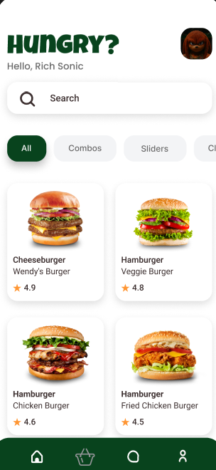
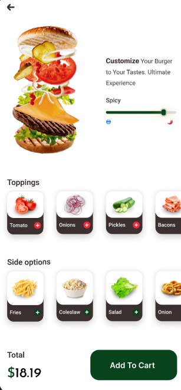
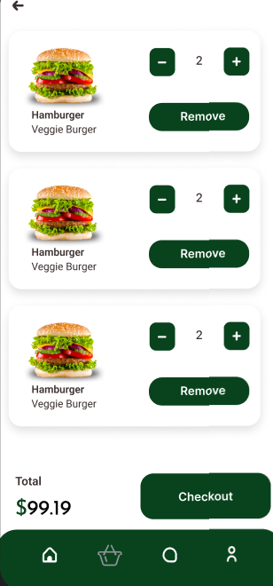
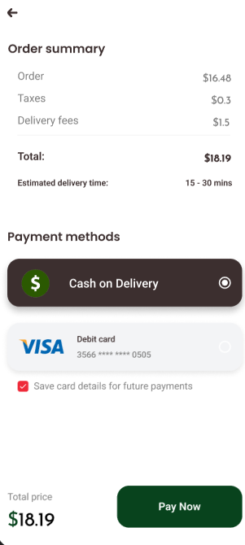

# Mr. Burger 🍔

A robust, production-ready Mobile Delivery Application built with **Flutter & Dart**. This project is designed and structured using strict **Clean Architecture** principles and **SOLID** design patterns to ensure maximum scalability, maintainability, and ease of testing.

> **Note:** This project is a work in progress (WIP), showcasing modern software engineering practices, feature-first approach, and advanced state management in Flutter.

---

## 📱 Application Preview (UI/UX)

| Home Screen | Product Customization | Shopping Cart | Checkout & Payment |
| :---: | :---: | :---: | :---: |
|  | |  |   |

---

## 🚀 Architectural Overview

The project is structured using the **Feature-First Approach**, where each feature (e.g., `auth`, `cart`, `product`) contains its own completely isolated layers. This ensures a clean **Separation of Concerns (SoC)**.

Each feature is divided into three main layers:

1. **Domain Layer (The Core):**
   - Completely independent of any external packages, UI, or data sources.
   - Contains pure Dart **Entities** (e.g., `UserEntity`, `ProfileEntity`) that represent the business data.
   - Contains **Use Cases** (e.g., `LoginUseCase`, `GetProfileUseCase`) encapsulating the core business logic.
   - Defines **Abstract Repositories** to enforce the *Dependency Inversion Principle (DIP)*.

2. **Data Layer (The Implementation):**
   - Implements the abstract repositories defined in the Domain layer.
   - Contains **Models** (e.g., `UserModel`, `ProfileModel`) that extend Entities and handle JSON serialization (`fromJson`/`toJson`).
   - Contains **Data Sources** (`Remote`/`Local`) to handle data fetching via HTTP/REST clients.

3. **Presentation Layer (The UI & State):**
   - Built using the **Cubit (Bloc)** state management pattern for reactive UI updates.
   - Follows a strictly defined state system (Initial, Loading, Success, Error) utilizing distinct state classes.
   - Contains highly reusable, loosely coupled UI components and custom views (`LoginView`, `ProfileView`, `SignUpView`).

---

## 🛠️ Tech Stack & Architecture Highlights

- **State Management:** Flutter BloC / Cubit (Lightweight, predictable, and clean).
- **Dependency Injection:** `GetIt` service locator used extensively to manage singletons and decouple dependencies across modules dynamically via sub-injections (`auth_injection.dart`, `home_injection.dart`).
- **Networking & API Client:** Built on top of `Dio` with a centralized network wrapper (`DioClient`, `ApiServices`), custom interceptors (for tokens and logging), and global timeout configurations.
- **Functional Error Handling:** Implemented using the `Either` type (via `dartz`) to elegantly catch exceptions at the data layer and return strongly-typed `Failure` objects (`ServerFailure`) to the UI.
- **SOLID Clean Code:** Decoupled dependencies using interface abstractions, allowing seamless mocking for future automated testing.

---

## 📁 Project Structure Preview

```text
lib/
│
├── core/                  # Global utilities, network clients, constants, themes
│   ├── network/          # Dio client configurations & API services
│   ├── error/            # Failure and exception handling mechanisms
│   └── constants/        # Centralized app configuration, sizes, and colors
│
├── features/             # Feature-First Modules
│   ├── auth/
│   │   ├── data/         # Models, Data Sources, Repo Implementations
│   │   ├── domain/       # Entities, Use Cases, Abstract Repos
│   │   └── presentation/ # Cubit/States, Views, Feature Widgets
│   ├── cart/
│   └── product/
│
└── utils/                # Dependency injection splitters (e.g., service_locator.dart)